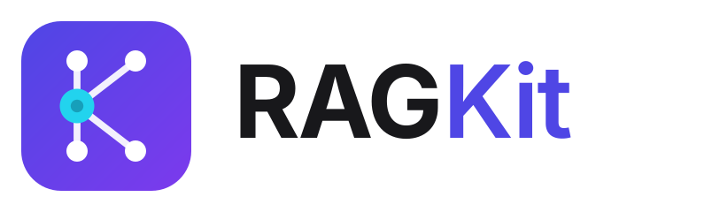

<p align="center">
  <picture>
    <source media="(prefers-color-scheme: dark)" srcset="docs/assets/logo-horizontal-dark.svg">
    
  </picture>
</p>

<p align="center">
  <strong>A modular, production-oriented foundation for building Retrieval-Augmented Generation systems.</strong>
</p>

<p align="center">
  
  
  
  
</p>

---

RAGKit takes you from **ingestion → parsing → chunking → embeddings → vector storage → retrieval → generation** without locking you into a single vector database, embedding provider, or LLM.

It's the project you clone when you're starting a real RAG system — not a demo.

---

## Why RAGKit?

Most RAG projects start as a tightly coupled chain:

```text
PDF → LangChain → Vector DB → OpenAI
```

That works for a prototype, but becomes hard to extend as requirements grow — a different vector store per environment, a different embedding model, OCR for scanned documents, multimodal inputs, custom chunking rules.

RAGKit separates these concerns behind explicit interfaces so each piece can be swapped, extended, or replaced independently.

```text
                    RAGKit
                       │
        ┌──────────────┼──────────────┐
        ↓              ↓              ↓
    Ingestion      Retrieval      Generation
        │              │              │
     Parser         Vector DB          LLM
     Chunker        PGVector          OpenAI
     Embeddings     Qdrant            Cohere
     OCR                              Ollama
```

---

## ✅ Status — v2.0.0

* **Vector storage** — fully migrated to PostgreSQL + PGVector (MongoDB removed). Qdrant remains fully supported; switch backends with a single `.env` variable.
* **Chunking** — custom token-aware chunker, no LangChain dependency required (LangChain chunking stays available as an option).
* **Pipelines** — async ingestion and retrieval paths, reworked for throughput.
* **Backend** — stable and deployable. Celery + Redis for distributed background processing is the next milestone.

---

## 🧰 The Toolbox

RAGKit is meant to be a **configurable toolbox you start production RAG projects from** — not just a vector-DB wrapper. Everything below follows the same provider-interface pattern already used for LLMs and vector stores, so adopting any of it is a config change, not a rewrite.

| Tool | Status | What it gives you |
| ---- | ------ | ----------------- |
| **Vector stores** | ✅ Shipped | PGVector, Qdrant — unified interface, `.env` switchable |
| **LLM providers** | ✅ Shipped | OpenAI, Cohere, Ollama |
| **Embedding providers** | ✅ Shipped | OpenAI, Cohere, Sentence Transformers |
| **Token-aware chunking** | ✅ Shipped | Custom chunker, LangChain optional |
| **Chunking strategies** | 🔜 Planned | Fixed-size, semantic, recursive, structure-aware — selectable per project |
| **OCR ingestion** | 🔜 Planned | Scanned PDFs and images into the pipeline, OCR as a swappable provider |
| **Multimodal** | 🔜 Planned | Image + text embeddings and multimodal-capable LLMs |

Planned tools land as new provider interfaces under `stores/` and are selected the same way as everything else:

```env
CHUNKING_STRATEGY=semantic
OCR_PROVIDER=tesseract
```

---

## ✨ Features

### 🧩 Modular architecture
Provider implementations are isolated from application logic — swap components without touching the pipeline.

### 🗄️ Multiple vector stores
PostgreSQL + PGVector (primary) and Qdrant, behind one interface.

```env
VECTOR_DB_PROVIDER=pgvector   # or qdrant
```

### ⚡ Async-first backend
FastAPI + Uvicorn, structured so heavier ingestion workloads can move to dedicated workers.

### 🐳 Dockerized infrastructure
PostgreSQL, PGVector, and Qdrant all runnable via Docker Compose.

### 🧪 Testing
`79 tests passing`, designed to run **without** the full infrastructure stack — validate components before deploying anything.

### 📊 Observability
Prometheus metrics (`rag_query_latency_seconds`, `retrieval_hit_rate`), kept separate from core RAG logic.

---

## 🏗️ Architecture

```text
                Documents
                    │
                    ▼
              ┌───────────┐
              │  Parser   │  ← OCR (planned)
              └─────┬─────┘
                    │
                    ▼
              ┌───────────┐
              │  Chunker  │  ← pluggable strategies (planned)
              └─────┬─────┘
                    │
                    ▼
             ┌────────────┐
             │ Embeddings │  ← multimodal (planned)
             └──────┬─────┘
                    │
                    ▼
        ┌──────────────────────┐
        │     Vector Store     │
        │  PGVector | Qdrant   │
        └───────────┬──────────┘
                    │
                    ▼
                 Retrieval
                    │
                    ▼
              ┌───────────┐
              │    LLM    │
              └─────┬─────┘
                    │
                    ▼
                 Response
```

The goal is not to hide the architecture behind a framework. **RAGKit keeps the major RAG components visible and replaceable.**

---

## 📦 Tech Stack

| Layer | Technology |
| ----- | ---------- |
| API | FastAPI + Uvicorn |
| Language | Python |
| Package management | uv |
| Vector store | PostgreSQL + PGVector / Qdrant |
| Embeddings | OpenAI / Cohere / Sentence Transformers |
| LLM | OpenAI / Cohere / Ollama |
| Chunking | Custom token-aware chunker |
| Database | PostgreSQL |
| Infrastructure | Docker / Docker Compose |
| Observability | Prometheus |
| Testing | Pytest |

---

## 🚀 Quickstart

**1. Clone**
```bash
git clone https://github.com/silvaxxx1/RAGKit.git
cd RAGKit
```

**2. Install dependencies**
```bash
uv init
uv add -r requirements.txt
```

**3. Configure environment**
```bash
cp uv.example .env
```
```env
VECTOR_DB_PROVIDER=pgvector   # or qdrant
EMBEDDING_PROVIDER=openai
LLM_PROVIDER=openai
```

**4. Start infrastructure**
```bash
cd docker
docker-compose up -d
```

**5. Run the backend**
```bash
uvicorn main:app --reload --host 0.0.0.0 --port 5000
```
Swagger UI → [http://localhost:5000/docs](http://localhost:5000/docs)

**6. Run tests**
```bash
pytest
```

---

## ⚙️ Configuration

Provider selection is configuration-driven.

```env
VECTOR_DB_PROVIDER=pgvector      # pgvector | qdrant
EMBEDDING_PROVIDER=openai        # openai | cohere | sentence_transformers
LLM_PROVIDER=openai              # openai | cohere | ollama
```

Changing providers should never require rewriting the RAG pipeline.

---

## 🧱 Design Principles

1. **Separation of concerns** — the pipeline shouldn't depend on a specific database or model provider.
2. **Replaceable infrastructure** — swap providers without rewriting business logic.
3. **Explicit abstractions** — every core component has a clear interface.
4. **Configuration over hard-coding** — provider selection lives in `.env`, not in code.
5. **Understandable architecture** — easy to read, modify, and extend.
6. **Production-oriented foundations** — patterns that survive the move from local dev to production.

---

## 🛣️ Roadmap

**Toolbox**
- [ ] Pluggable chunking strategies (semantic, recursive, structure-aware)
- [ ] Out-of-the-box OCR ingestion
- [ ] Multimodal embeddings and LLMs

**Infrastructure**
- [ ] Celery + Redis background workers
- [ ] Additional vector-store providers
- [ ] Kubernetes deployment templates
- [ ] CI/CD examples

**Retrieval**
- [ ] Hybrid dense + BM25 retrieval
- [ ] Reciprocal Rank Fusion
- [ ] Reranking
- [ ] Multi-query and parent-child retrieval

**Evaluation**
- [ ] Retrieval and generation evaluation
- [ ] RAGAS integration
- [ ] Golden datasets and latency benchmarking

---

## 🔭 RAGKit vs. Production Platforms

RAGKit focuses on the **foundation**, and doesn't try to solve every production concern out of the box.

For environments involving strict data residency, distributed ingestion, advanced retrieval, dedicated inference infrastructure, and compliance requirements, a purpose-built platform architecture may be the better fit. RAGKit is where you start — and what you extend.

---

## 🤝 Contributing

Contributions are welcome: new vector-store providers, embedding and LLM providers, chunking strategies, OCR backends, retrieval strategies, evaluation tools, deployment templates, and documentation.

The preferred pattern is to **extend an existing interface** rather than add provider-specific logic to the application layer.

---

## 📄 License

MIT License — see [LICENSE](./LICENSE)
